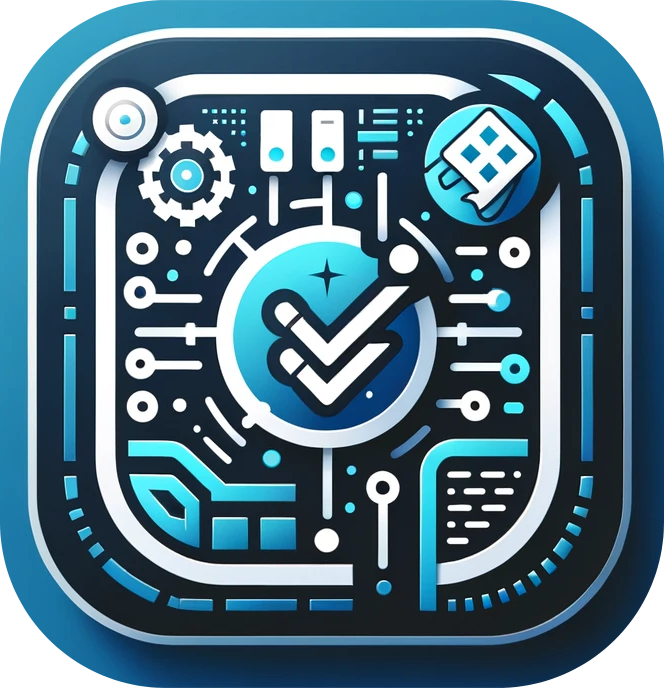

<div align="center">
  <a href="https://github.com/Kowts/cs50p_final_project">
    
  </a>

<h3 align="center">ProTaskVista</h3>

  <p align="center">
    CS50P Final Project
    <br />
    <a href="#">Video Demo</a>
  </p>
</div>

## Description

ProTaskVista is a PyQt-based desktop application designed to streamline personal task management. The application is designed to help users manage their tasks efficiently and it features a modern UI, a robust backend for handling tasks, and various utilities for an enhanced user experience.

## Features

- **Task CRUD**: Create, read, update, and delete tasks with ease.
- **Task Prioritization**: Assign priorities to tasks and organize your day.
- **Search Functionality**: Quickly find tasks with a powerful search feature.
- **Printing Capability**: Print out task lists for offline reference.
- **User Customization**: Set preferences such as themes and notification settings.
- **User Authentication**: Secure login and registration system for user accounts.
- **User Preferences**: Customize application settings such as themes, notification preferences, and more.
- **Priority and Category Management**: Organize tasks with custom priorities and categories.
- **Calendar Integration**: View tasks in a calendar format and manage deadlines.
- **Database Integration**: Robust SQLite database integration for storing tasks and user information.
- **Responsive UI**: A modern and responsive user interface built with PyQt6.
- **Notifications**: Get notified about due tasks via email or desktop notifications.
- **Task Tracking**: A background thread that periodically checks for and notifies about due tasks.

### Non-Functional Requirements

- **Security**: User data is stored securely.
- **Performance**: The application is responsive and performs well.
- **Usability**: The application is easy to use.
- **Maintainability**: The application is easy to maintain.
- **Extensibility**: The application is easy to extend.

## Project Structure

### Directories
- `ui/`: Contains all user interface components.
  - `dialogs/`: Dialog windows like login, registration, edit task, and preferences (Each dialog gets its file).
  - `main_window.py`: The main window of the application.
- `models/`: Data models and business logic.
  - `task_manager.py`: Manages tasks and database interactions.
  - `task_tracker.py`: Background task tracking logic.
- `tests/`: Unit tests for the application.
- `database/`: Database-related files.
  - `database.db`: Database file - SQLite.
  - `schema.sql`: Database schema.
- `services/`: Services and managers for specific functionalities.
  - `notification.py`: Manages sending notifications.
  - `preferences.py`: Handles user preference settings.
- `helpers/`: Utility functions and helpers.
  - `utils.py`: Common utility functions used across the application.
  - `constants.py`: Constants used across the application.
- `resources/`: Static resources like images and icons.

### Key Components
- `TaskTracker`: A background thread that periodically checks for and notifies about due tasks.
- `TaskManager`: Central class for task-related operations and database management.
- `MainWindow`: The primary window of the application, orchestrating various components.
- `PreferencesDialog`: A dialog window for managing user preferences.
- `EditTaskDialog`: A dialog window for creating and editing tasks.
- `LoginDialog`: A dialog window for logging in to the application.
- `RegistrationDialog`: A dialog window for registering a new user.
- `NotificationService`: A service for sending notifications.
- `PreferencesService`: A service for managing user preferences.

### Database Schema

The application uses a SQLite database for storing data and consists of the following tables:

- `users`: Stores user information such as username, password, and email. The `users` table includes fields for the user's ID (primary key), username, password, password salt, creation date, status, and email.

- `tasks`: Stores task information such as title, description, priority, category, and due date. This table contains fields for task ID (primary key), user ID (linking to the `users` table), task name, due date, priority, category, creation date, and status.

- `sqlite_sequence`: A special table used by SQLite. It is used to keep track of the largest rowid that was inserted into each table that uses AUTOINCREMENT.

- `categories`: Manages categories for tasks. It includes fields for category ID (primary key), user ID, category name, creation date, and status.

- `preferences`: Holds user preferences. This table has fields for preference ID (primary key), user ID, preference key, preference value, creation date, and status.

- `user_activity`: Tracks user activities. It includes fields for activity ID (primary key), user_id, activity type, creation date, and status.

- `priorities`: Defines different priority levels for tasks. It contains fields for priority ID (primary key), user ID, priority name, color associated with the priority, creation date, and status.

Each table is designed to store specific aspects of user data and task management, facilitating efficient data retrieval and manipulation for the application.


## Design Decisions

### User Authentication

The login system implemented was to provide a personalized and secured experience for each user, the need for personalized task lists was a deciding factor.

### Task Persistence

SQLite was chosen as the database solution for its simplicity and ease of deployment. While other database systems offer more features, SQLite meets our requirements without adding complexity.

### Extensibility

The application was designed with extensibility in mind. The modular nature of the codebase allows for easy expansion, such as adding new features or integrating with external services.

## Getting Started

### Prerequisites
Before you begin, ensure you have the following installed:
- Python 3.6 or higher
- PyQt6
- SQLite3 (if using a SQLite database)
- pytest (testing framework)

You can install PyQt6 using pip:

```bash
pip install PyQt6
```

### Installation

1. **Clone the Repository**

   First, clone the repository to your local machine:

   ```bash
   git clone https://github.com/Kowts/cs50p_final_project.git
   cd cs50p_final_project
   ```

2. **Set Up Environment Variables**

   Set the necessary environment variables. You can do this by creating a `.env` file in the root directory and adding the required configurations. For example:

   ```
    # Database Configuration
    DATABASE_FILE=database.db
    MAX_CONNECTION=10

    # Default Values
    DEFAULT_PRIORITIES=Low,Medium,High
    DEFAULT_CATEGORIES=Work,Personal,Shopping,Other
    FONT_SIZE=8,10,12,14,16,18,20,24
    THEME=Default,Light,Dark

    # Default User
    DEFAULT_USER=admin
    DEFAULT_PASSWORD=P@ssw0rd
    ADMIN_EMAIL=admin@mail.xpto

    # Default SMTP Server
    SMTP_USER=
    SMTP_PASS=
    SMTP_URL=
    SMTP_PORT=
   ```

3. **Install Dependencies**

   Install any additional dependencies (if applicable):

   ```bash
   pip install -r requirements.txt
   ```

### Running the Application

To run the application, execute the `project.py` script from the command line:

```bash
python project.py
```

This will launch the ProTaskVista application. You can log in using the default credentials or create a new account.

### First Time Setup

- On the first run, the application will set up the necessary database tables.
- You may be prompted to create an initial user account if none exists.

### Usage

- Use the login dialog to access the application.
- Once logged in, you can add, edit, and delete tasks, manage priorities and categories, and set your preferences.

### Testing

The project uses pytest for testing. To run the tests, follow these steps:

1. Install pytest if you haven't already:
```bash
pip install pytest
```
2. Navigate root and run the tests:
```bash
pytest
```

## Credits

- To the CS50 Team for the comprehensive content and effective learning methods offered in this course.
- A special thanks to Professor [David C. Malan](https://github.com/dmalan) for his engaging and insightful lectures - truly exceptional!

## References

- [CS50P EDX](https://www.edx.org/course/cs50s-introduction-to-programming-with-python)
- [CS50P Harvard](https://cs50.harvard.edu/python/2022/)
- [CS50 Youtube Channel](https://www.youtube.com/c/cs50)
- [Final Project Instructions](https://cs50.harvard.edu/python/2022/project/)

## License

This project is licensed under the MIT License - see the [LICENSE.md](LICENSE.md) file for details
